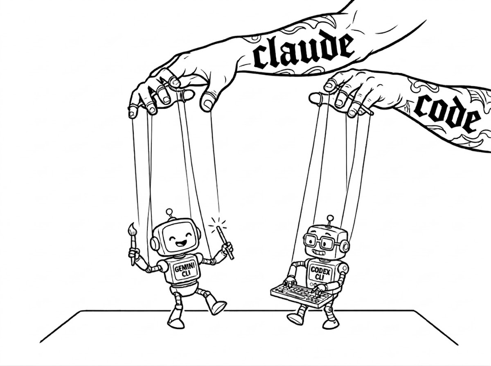
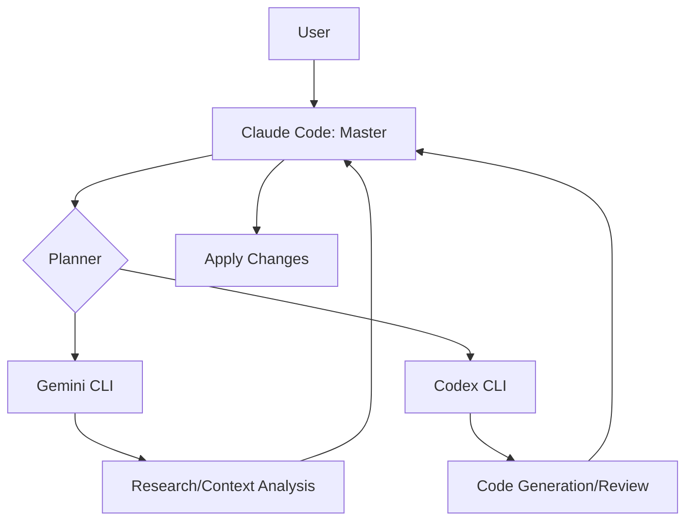

# Claude Puppets: Gemini CLI & Codex Orchestrator

<p align="center">
  
</p>

## Overview

**Claude Puppets** is a sophisticated orchestration framework that empowers **Claude Code** to act as a "master puppeteer," delegating complex, long-running, or resource-intensive tasks to specialized CLI tools and AI models. By leveraging **Gemini CLI** for massive context processing and **Codex** for deep code analysis, this system achieves a level of automation and power beyond any single model.

---

## 🚀 Key Features

- **Master Orchestrator (Claude Code)**: Intelligent task decomposition and workflow management.
- **Gemini Delegation**: Seamlessly offload tasks to Google's Gemini API for 2M+ token context and lightning-fast processing.
- **Codex-Powered Review**: Automated, high-fidelity code reviews and security audits.
- **Advanced Planning**: Built-in multi-step planner for complex architectural and implementation tasks.
- **MCP Native**: Integrates with the Model Context Protocol (MCP) for extensible toolsets.
- **Role-Based Expertise**: A comprehensive library of specialized agent roles (Coder, Researcher, Reviewer, etc.).

---

## 🛠️ Project Structure

- `agents/` & `roles/`: Specialized persona definitions for task-specific AI behaviors.
- `skills/`: Core logic for task delegation:
    - `planner`: Orchestrates multi-step workflows.
    - `gemini-delegate`: Delegates tasks to Gemini CLI.
    - `codex-review`: Automated code review via Codex.
- `mcp/`: Extensible Model Context Protocol server for custom tool integration.
- `scripts/`: PowerShell-based automation for local environment management.
    - `Invoke-GeminiDelegate.ps1`: Core delegation logic for Gemini.
    - `Invoke-CodexDelegate.ps1`: Core delegation logic for Codex.
    - `Invoke-Flow.ps1`: Executes automated task sequences.
- `flow.config.json`: Declarative workflow definitions.

---

## ⚡ Quick Start

1.  **Installation**: Run the setup script to initialize the orchestration environment:
    ```powershell
    .\Install-Dispatcher.ps1
    ```
2.  **Configuration**: Refer to `SETUP.md` to configure your API keys (Anthropic, Google Gemini, etc.) and environment variables.
3.  **Deployment**: Launch the main dispatcher to begin orchestrating tasks:
    ```powershell
    .\Start-Dispatcher.ps1
    ```

---

## 📖 Documentation

- `CLAUDE.md`: Detailed usage guide and instructions for Claude Code.
- `SETUP.md`: Comprehensive environment setup and prerequisites.
- `FUTURE_IDEAS.md`: Roadmap and upcoming capabilities for the puppeteer system.

---

## Architecture



### Role Assignments

| Role | Tool | Use Case |
|------|------|----------|
| **Planner** | Claude Code | Always — decomposes tasks, routes, applies final changes |
| **Researcher** | Gemini CLI | High context (>200k tokens), documentation, creative ideation |
| **Code Implementer** | Codex CLI | Precise code generation, algorithms, refactoring |
| **Reviewer** | Codex CLI | Code review, security audit, bug identification |

---

*This project bridges the gap between different AI ecosystems, providing a unified "brain" for complex development workflows.*
